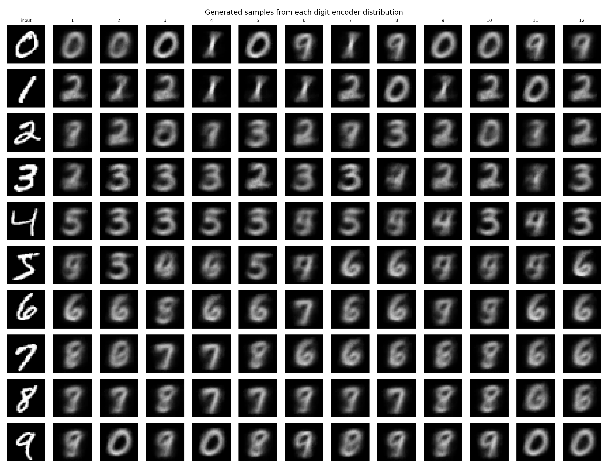
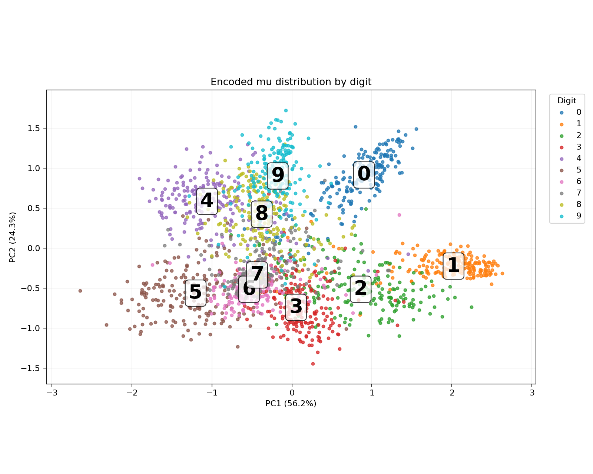
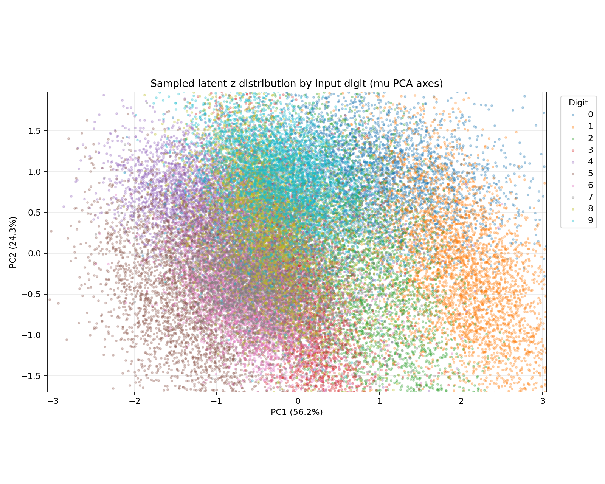
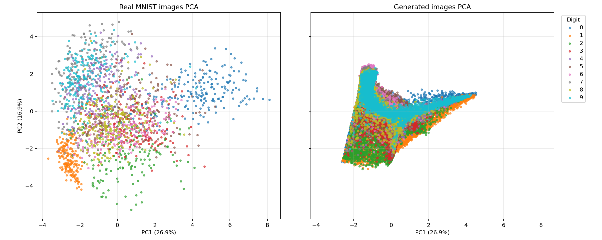

# 席取り損失の実装を確認

> このフォルダはVAEによる画像の埋め込みに関して、一つの入力に対して出力の正解が確率的に複数存在する場合に、それらをうまく出力できるような埋め込みを実現するための損失関数・席取り損失を導入して、MNISTの0-9の数字画像に対し、自身を含む前後の画像を正解として出せるような埋め込みを行うテストプログラムです。席取り損失は、例えば正解が３通りありうる場合は、VAEのエンコーダ出力である平均と分散で決まる正規分布から潜在変数を多数サンプリングしたとき、潜在変数のサンプル１つずつに対してデコーダによる生成結果が最も近い（たとえばMSE最小）正解を割り付けますが、一つの正解にはたかだか1/3のサンプル個数しか割り付けないようにするものです。つまり１００個の潜在変数サンプルのうち１つ目の正解が一番近かったサンプルが５０個あったら、この内近い３３個はその正解に割り付けますが、あぶれた17個は２番目に近い正解に割り付けます。２番目も1/3つまり33個をこえたら、残りは３番目の正解に割り付けます。こうやって割り付けた正解との差のMSEを損失関数として勾配を逆伝播するわけです。こうすると、一つの入力に対してエンコーダが出力する分布は３つの正解を均等にカバーするように平均と分散が配置され、またそのような分布配置からデコーダが３種類の正解を生成するようになるはずです。そういう機能を発揮するかどうかをテストするためのコードになっていますが、先ずフォルダのソースコードを読んで、意図通りのコードになっているか確認してください。

<details><summary>10 previous messages</summary>

> まず全体構成と主要ファイルをざっと読みます。席取り損失の実装、データセットの「前後数字」ターゲット作成、VAEのサンプリングと逆伝播の流れを中心に確認します。
>
> ファイル数は小さめで、`*_5.py` 系と無印系の2系統がありそうです。まず README と損失・学習・データ生成まわりを並べて読んで、実装上の分岐を見ます。
>
> `loss.py` と `loss_5.py` で席取りの考え方が少し違います。無印は「最も近い予測から順に各予測の好みへ入れる」型、`_5` は各教師側の近い順リストから全体最小を選ぶ型なので、どちらが学習で使われているか確認します。
>
> 学習側は `train_fixed.py` が3教師、`train_fixed_5.py` が5教師の実験版です。次に教師画像の選び方が「自身を含む前後」になっているか、端の数字 0/9 の扱いも含めて確認します。
>
> 教師は無印系では `(digit-1) % 10, digit, (digit+1) % 10` なので、0 は 9/0/1、9 は 8/9/0 になります。ここは「前後」を循環として扱う設計で、線形に 0 なら 0/1 だけ等ではありません。
>
> 席取り損失の中身は勾配を切っていません。割り当ての決定だけは `argsort`/`item()` で離散的に決まり、その後に選ばれた `loss_matrix[g, t]` を `stack` して平均しているため、選ばれた再構成画像には勾配が戻る形です。
>
> 軽い合成データで、席取り損失がスカラーになり、逆伝播で `pred` に勾配が立つかも確認中です。MNIST ダウンロードは伴わない `loss` 単体の検査なので、コードの核だけを触っています。
>
> 合成データ上では無印3教師版も5教師版も、割り当て数は均等で、損失から勾配も戻ります。つまり「席取りで選んだ MSE を逆伝播する」という最小限の機械部分は動いています。
>
> 可視化側も確認しています。ここで1点、生成サンプルの出し方が3教師版と5教師版で違っていて、3教師版は入力画像をエンコードした分布から生成、5教師版は標準正規から直接生成になっています。5教師版の可視化は学習意図の確認としては少しズレています。
>
> 最後に構文レベルのチェックも入れます。学習本体は 200 epoch 走らせると時間がかかるので、今回はソース読解と損失関数単体の動作確認に絞ります。
</details>

確認しました。結論として、`train_fixed.py` + `loss.py` + `data_utils.py` の3教師版は、かなり意図に近い構成です。VAE の `mu/logvar` から `num_samples=99` 個の `z` をサンプリングし、各入力に対して `[digit-1, digit, digit+1]` の3教師を作り、各教師に33個ずつ再構成サンプルを割り当て、その MSE を逆伝播しています。

主な確認点です。

- VAE の再パラメータ化は OK
  [model.py:70](./model.py:70) で `eps` を `num_samples x batch x latent_dim` 生成し、`mu + eps * std` しています。

- 学習ループも意図通り
  [train_fixed.py:64](./train_fixed.py:64) でエンコード、[train_fixed.py:65](./train_fixed.py:65) で多数サンプリング、[train_fixed.py:66](./train_fixed.py:66) でデコードし、[train_fixed.py:74](./train_fixed.py:74) の席取り損失で学習しています。

- 教師は「前・自身・後」の3数字
  [data_utils.py:5](./data_utils.py:5) で `[(digit - 1) % 10, digit, (digit + 1) % 10]` です。つまり 0 は `9,0,1`、9 は `8,9,0` になります。

- 席取り損失は勾配が戻る
  [loss.py:114](./loss.py:114) で全 MSE 行列を作り、[loss.py:130](./loss.py:130) 以降で割り当て、[loss.py:143](./loss.py:143) で選ばれた Tensor を `stack` しているので、選ばれた再構成サンプルには autograd が効きます。合成データでも `loss.backward()` で `pred.grad` が非ゼロになることを確認しました。

注意点もあります。

1. `loss.py` の割り当ては「各サンプルを最小 MSE 順に処理し、空いている最も近い教師へ入れる」貪欲法です。説明にある「ある教師に近い50個のうち近い33個をその教師へ」という動作にかなり近いですが、厳密な最小コスト割当や、教師ごとの最近傍リストからの完全な席取りではありません。より説明通りに寄せるなら、`loss_5.py` 側の [loss_5.py:27](./loss_5.py:27) 以降の方式のほうが近いです。

2. 固定教師版では「自身の画像そのもの」ではなく、「その数字クラスの固定代表画像」が教師です。該当箇所は [data_utils.py:10](./data_utils.py:10) です。もし「入力画像自身を same 教師にしたい」という意味なら、今のコードは違います。

3. `loss.py` の先頭にある `compute_related_digit_loss` と `select_top100_recon_labels` は古い実装っぽく、100サンプル固定です。[config.py:17](./config.py:17) は現在 `num_samples=99` なので、この2関数は使わない前提なら問題ありませんが、使うと不整合が出ます。

4. `train_fixed_5.py` は5教師実験ですが、設定は `num_samples=99` のままです。5教師だと均等に割れず、`20,20,20,20,19` の割り当てになります。5教師版を本命にするなら `num_samples=100` などが自然です。

検証として `python -m py_compile *.py` は通りました。学習全体は 200 epoch なので今回は走らせていませんが、ソース上は3教師固定版の席取り VAE テストとしては概ね意図通りです。

> MSEの小さい順に貪欲法、というのは正解が３つある場合にはどれとのMSE順なのかがあいまいですね。コードはどうなっていますか。狙っているのは３通りの正解とのMSEをすべて求め、そのうちの最小MSE順に評価するものです。しかし１つ目の正解の席が33個全て埋まってしまったら、その後は１つ目の正解とのMSEは意味がなくなりますから、２つ目の正解とのMSEの小さい順に評価していくべきです。そうなっているでしょうか。

いいえ、現在メインで使われている `train_fixed.py` → `loss.py` の `sekitori_loss_sum` は、厳密にはその挙動になっていません。

現在の流れはこうです。

1. 各サンプル `pred[g]` について、3正解すべてとの MSE を計算
   [loss.py:114](./loss.py:114)

2. 各サンプルごとの「最小 MSE」と「最も近い教師」を求める
   [loss.py:121](./loss.py:121)

3. その **最小 MSE の小さい順** にサンプルを固定順序で処理する
   [loss.py:125](./loss.py:125)

4. 各サンプルについて、近い教師順に見て、空席がある最初の教師へ割り当てる
   [loss.py:130](./loss.py:130)

つまり、ある教師の席が埋まったあとも、処理順そのものは最初に計算した「3教師中の最小 MSE 順」のままです。
「1つ目の正解が満席になったら、その教師との MSE は候補から消し、残り教師との MSE の小さい順に改めて評価する」という動的な再評価にはなっていません。

一方で、`loss_5.py` の `sekitori_loss_sum` はかなり狙いに近いです。こちらは各教師ごとに MSE 昇順リストを作り、満席でない教師だけを候補にして、その時点での最小 MSE ペアを選びます。

該当箇所は [loss_5.py:27](./loss_5.py:27) 以降です。

```python
orders = [torch.argsort(mse_b[:, r]) for r in range(n_rel)]
...
for r in range(n_rel):
    if quotas[r] <= 0:
        continue
    ...
    val = mse_b[idx, r].item()
    if val < best_val:
        best_val = val
        best_rel = r
        best_idx = idx
```

こちらは教師 `r` の席が埋まったら `quotas[r] <= 0` で候補から外れるので、「埋まった正解との MSE は以後意味がない」という考え方に合っています。

なので結論は：

- `train_fixed.py` が使う `loss.py` は、狙いと少し違う
- `loss_5.py` の方式は、狙っている席取りに近い
- 3正解版でも `loss_5.py` 型の実装に置き換えるのがよさそうです

> ３正解版をそのように修正しましょう。それから教師として与える３つの画像ですが、固定正解にするのはVAEとしては面白くありません。同じ数字の正解をランダムに選んで正解とするようにしたいです。その意味では同じ数字の画像も入力自身ではなく同じ数字からランダムに選んだ画像を割り当てたいです。

<details><summary>16 previous messages</summary>

> 了解です。変更は2点に分けます。まず3正解版の `sekitori_loss_sum` を「満席の教師を候補から外し、その時点で残っている教師との最小 MSE ペアを選ぶ」方式へ寄せ、次に固定教師版の学習がランダム教師を使うように入口を切り替えます。
>
> 実装上「入力自身を除外」を厳密にやるには、データセット index を返す形に変えるか、入力テンソルと候補画像の完全一致を除外する必要があります。今回は既存の学習ループへの影響を小さくして、教師サンプリング関数に `inputs` を渡せるようにし、same digit の候補から入力画像と一致するものを避ける形にします。
>
> これから編集します。`loss.py` は割り当て順を動的な席取りに変更し、`data_utils.py` はランダム教師を入力画像除外付きで取れるようにして、`train_fixed.py` の学習・検証でそのランダム教師を使うようにします。
>
> <details><summary>Edited a file</summary>
>
> - Wrote `./loss.py` (+35 -16)
> - Wrote `./loss.py` (+31 -12)
>
> </details>
>
> 損失側は切り替わりました。次に教師サンプリングを、3つの関連数字それぞれからランダムに1枚選び、same digit では入力画像と同一の候補を避けるようにします。
>
> <details><summary>Edited a file</summary>
>
> - Wrote `./data_utils.py` (+19 -6)
>
> </details>
>
> 学習スクリプト側は `train_fixed.py` という名前のままですが、中身はランダム教師版に切り替えます。固定代表画像は生成確認・全数字の監視点としてだけ残し、損失に入る教師は毎回ランダムになります。
>
> <details><summary>Edited a file</summary>
>
> - Wrote `./train_fixed.py` (+10 -10)
>
> </details>
>
> 既存の `train_random.py` も同じサンプリング関数を使っているので、そちらも同じ意味になるように入力除外を渡します。これでランダム教師系の入口が揃います。
>
> <details><summary>Edited a file</summary>
>
> - Wrote `./train_random.py` (+3 -3)
>
> </details>
>
> 編集は入りました。ここからは、構文チェックと損失関数の単体検査に加えて、MNIST データがローカルにあれば教師サンプリングが入力自身を避けているかも軽く確認します。
>
> ローカルに `data/` は無かったので、MNIST を実際に読み込む検査はネットワークが絡む可能性があり避けています。損失関数単体では、3教師へ33個ずつ割り当て、損失から勾配が戻るところまで確認できました。README の説明も、固定教師前提のままだと混乱するので最小限直します。
>
> <details><summary>Edited a file</summary>
>
> - Wrote `./README.md` (+3 -3)
>
> </details>
>
> 差分を見て、README に古い出力先名が残っていました。コードの挙動と合うようにそこも整えておきます。
>
> <details><summary>Edited a file</summary>
>
> - Wrote `./README.md` (+4 -4)
>
> </details>
>
> これでコードと README の整合も取れました。最後に構文チェックと損失の勾配・割り当て数チェックをもう一度流します。
</details>

修正しました。

`loss.py` の3正解版 `sekitori_loss_sum` は、各教師ごとに MSE 昇順リストを持ち、満席になった教師は候補から外したうえで、その時点で残っている `(sample, teacher)` の最小 MSE を選ぶ方式に変えました。つまり、ある正解の33席が埋まった後は、その正解との MSE は以後の選択に使われません。`sekitori_loss_worst_percent` 側も同じ割り当て方式に揃えています。

教師画像については、[data_utils.py](./data_utils.py) の `sample_related_images_batch(labels, inputs=None)` を拡張し、`inputs` を渡した場合は same digit の候補から入力画像そのものと一致する画像を除外してランダム選択するようにしました。
[train_fixed.py](./train_fixed.py) は固定教師ではなく、このランダム教師を使うように切り替えています。既存の [train_random.py](./train_random.py) も同じ入力除外付きランダム教師に揃えました。

確認済みです。

```text
python -m py_compile *.py
sekitori_loss_sum: assigned_shape (2, 3, 33), grad_nonzero True
sekitori_loss_worst_percent: assigned_shape (2, 3, 33), grad_nonzero True
```

MNIST の `data/` がローカルに無かったため、実データでの短時間学習までは走らせていません。ネットワーク取得が必要になる可能性があるため、今回は構文チェックと損失関数単体の勾配確認までにしています。

> その順番の割り付け方で、きちんと一番近い教師にサンプルが割りついていくでしょうか。もちろんより近いサンプルがいて席がなくなったら次善のサンプルにわりつけていくわけです。

はい、今の修正版はその意図に沿っています。

実装上は、各教師ごとに「その教師との MSE が小さいサンプル順」のリストを作っています。

[loss.py](./loss.py) では概念的にこうです。

```python
orders = [torch.argsort(loss_matrix[:, t]) for t in range(T)]
```

つまり教師0用、教師1用、教師2用に、それぞれ MSE 昇順のサンプル待ち行列を持ちます。

その後、まだ席が残っている教師だけを見て、各教師の先頭候補の中から一番 MSE が小さい `(sample, teacher)` ペアを選びます。教師が満席なら候補から外れますし、すでに別教師に割り付いたサンプルもスキップされます。

なので挙動は、

1. 全教師・全サンプルの MSE ペアを小さい順に見る
2. その教師に席があれば割り付ける
3. そのサンプルがまだ未使用なら割り付ける
4. 教師が満席なら、その教師との MSE は以後無視する
5. サンプルの最も近い教師が満席なら、次に小さい MSE の教師候補で拾われる

という形です。

したがって、「より近いサンプルが先に席を取ってしまったら、残ったサンプルは次善の教師へ割り付く」という席取りの貪欲法になっています。

ただし一点だけ厳密に言うと、これは **全体最適な最小総 MSE 割当** ではなく、**MSE 小さい順の貪欲割当** です。ユーザーさんの説明している席取り損失の意図には、この貪欲版で合っています。全体最適を求めたい場合は Hungarian 法や min-cost flow 系になりますが、今の「席が埋まったら次善へ」という直感的な席取りとは少し別物です。

> 全体最適を取りたいわけではないので（そもそもエンコーダの出力分布が暫定でしかなく、サンプルと正解のMSEもデコーダが不完全なら厳密にマッチングを全体最適化しても意味がないからです。

はい、その考え方なら今の貪欲な席取りでよいと思います。

この損失で欲しいのは「その時点のデコーダ出力で、各正解に近いサンプルから順に席を取らせる」という学習信号であって、固定されたコスト行列に対する厳密な最適マッチングではないですね。エンコーダ分布もデコーダも学習途中で動くので、全体最適割当を強く解くより、局所的に「近いものを採用し、満席なら次善へ回す」ほうが目的に合っています。

今の実装はまさにその方針です。

- 各正解ごとに MSE が小さいサンプルを優先
- すでに他の正解に割り付いたサンプルは除外
- 満席になった正解は以後候補から除外
- 残った正解の中でまた最小 MSE のペアを選ぶ

なので、「各正解が近いサンプルを最大1/3まで取り、それを超えた分は他の正解側へ流れる」という席取り損失として自然な挙動になっています。

> これでMNISTデータセットを使って訓練を回したいです。モデルを10エポックごとに保存してあとから検証できるようにしたいです。

<details><summary>37 previous messages</summary>

> では訓練後に検証できるよう、まず `train_fixed.py` に10エポックごとのチェックポイント保存を入れます。保存内容はモデル重みだけでなく、optimizer、epoch、主要ハイパーパラメータも含めて、あとから再開・解析しやすい形にします。
>
> 学習スクリプトの末尾まわりに保存処理を追加します。10エポックごとに `checkpoints/random_teacher/YYYY-MM-DD/epoch_0010.pt` のように保存する形にします。
>
> <details><summary>Edited a file</summary>
>
> - Wrote `./train_fixed.py` (+45 -0)
>
> </details>
>
> 保存処理を入れました。次に構文チェックをしてから、実際の訓練起動を試します。MNIST がまだ無いので、最初の実行はダウンロードで止まる可能性があります。
>
> 構文チェックは通りました。では `train_fixed.py` を起動してみます。200エポック設定なので、動き始めたら進捗を見ながら必要に応じて止めずに追跡します。
>
> 通常サンドボックスでは DNS が使えず、MNIST のダウンロードで止まりました。訓練にはデータ取得が必要なので、ネットワーク許可付きで再実行します。
>
> 訓練は動き始めています。MNIST は取得済みで、現在 CPU で進行中です。チェックポイント保存先は `checkpoints/random_teacher/2026-07-01` です。
>
> いま epoch 9 まで来ています。epoch 10 終了時に最初の `epoch_0010.pt` が保存されるはずなので、そこを確認します。
>
> epoch 10 の保存は成功しました。訓練はそのまま継続していて、次は epoch 20 で保存されます。 loss は初期の大きい値から 50 前後まで落ちてきています。
>
> epoch 20 の保存も成功しました。現在 epoch 25 付近で続行中です。200まで回すと少し時間はかかりますが、このまま最後まで見届けます。
>
> epoch 30 のチェックポイントも保存済みです。ここまで見る限り、保存機構は期待通り10エポック刻みで動いています。
>
> epoch 40 のチェックポイントも保存されました。訓練は安定して進んでいて、以降も `epoch_0050.pt`, `epoch_0060.pt` ... の形で保存されます。
>
> もうすぐ epoch 50 です。ここで5個目のチェックポイントが保存されます。画像出力も10エポックごとに並行して作られています。
>
> epoch 50 のチェックポイントが保存されました。訓練の出力はかなり多いですが、プロセス自体は正常に走っています。
>
> epoch 60 まで保存されました。ここから後半も同じペースで進んでいます。保存先にはすでに `epoch_0010.pt` から `epoch_0060.pt` まであります。
>
> 現在 epoch 65 付近です。終盤までまだありますが、保存の節目は順調に通過しています。
>
> epoch 70 が近いです。学習は MSE 47〜49 あたりで上下しながら進んでいます。席取り教師が毎回ランダムなので、この揺れ自体は自然です。
>
> epoch 70 のチェックポイントも保存されています。長めの実行ですが、プロセスは落ちずに進行しています。
>
> epoch 80 の終端に来ています。ここで `epoch_0080.pt` が保存される見込みです。
>
> epoch 80 の保存を確認しました。現在 epoch 85 まで来ています。あと少しで中間の `epoch_0090.pt` です。
>
> epoch 90 のチェックポイントも保存されました。訓練は中盤に入りました。
>
> epoch 100 のチェックポイントまで保存済みです。ここでちょうど半分を越えました。
>
> epoch 110 の保存タイミングです。出力上はまもなく `epoch_0110.pt` が作られます。
>
> epoch 110 のチェックポイントを確認しました。次は epoch 120 で保存されます。
>
> epoch 120 のチェックポイントまで保存済みです。現在は epoch 129 付近、次の保存は 130 です。
>
> epoch 130 のチェックポイントまで保存されました。だいぶ後半に入っています。
>
> epoch 140 のチェックポイントまで保存されました。あと60エポックです。
>
> epoch 140 の保存も終わり、150が目前です。画像・チェックポイントともに増え続けています。
>
> Context compaction
>
> Source: automatic
> Status: completed
>
> 続きから確認します。学習はまだ走っているはずなので、まず端末セッションを覗いて、最後まで進んでいるかとチェックポイントの保存状況を見ます。
>
> 現在166エポック目まで進んでいます。10エポックごとの保存は機能していて、直近では `epoch_0160.pt` が保存済みです。
>
> 170エポックの保存も通っています。あと30エポック弱なので、このまま200まで見届けます。
>
> 学習は安定して進んでいます。値はだいたい Train MSE 45 前後、Val MSE 46 前後で推移していて、180の保存まであと少しです。
>
> 180エポックのチェックポイントも保存されました。訓練はまだ正常に継続中で、190と200の保存まで確認します。
>
> 190エポック目まで到達しました。保存行が次の出力に出るはずなので、そこも含めて最後まで確認します。
>
> `epoch_0190.pt` も保存済みです。あと5エポックほどで完走なので、最後の `epoch_0200.pt` まで確認してから保存ファイル一覧を見ます。
>
> 完走しました。最後にチェックポイントの実ファイル一覧と、今回触ったファイルの状態だけ確認して締めます。
</details>

訓練を200エポックまで完走しました。10エポックごとの保存も確認済みで、`epoch_0010.pt` から `epoch_0200.pt` まで揃っています。

保存先:
`/Users/shimadalocal/src/Phoneme2Img/phoneme2img/sekitori_mnist-master/checkpoints/random_teacher/2026-07-01/`

最終エポックの値は以下です。

```text
Epoch 200/200
Train MSE: 45.1075  KLD: 4.0339
Val   MSE: 46.9887  KLD: 3.8014
```

今回の変更ファイルは [loss.py](./loss.py)、[data_utils.py](./data_utils.py)、[train_fixed.py](./train_fixed.py)、[train_random.py](./train_random.py)、[README.md](./README.md) です。事前に `python -m py_compile *.py` も通しています。

> MSE46というのはあまりよくないのでは。最終的な潜在空間上の0-9の各数字の分布や、生成された画像の分布を表示したいです。

<details><summary>11 previous messages</summary>

> たしかにMNISTの0-1正規化画像で画素和MSEが46前後だと、かなりぼやけた再構成/生成になっている可能性があります。まず既存の可視化コードとモデル定義を読んで、チェックポイントから潜在分布と生成画像を出すスクリプトを足します。
>
> 既存の学習中可視化は「各数字1枚の固定サンプル」中心なので、最終モデルの分布を見るには少し足りません。今回はチェックポイントを読み、テストセット全体の encoder μ/logvar と、各数字条件からの生成サンプル分布をまとめて描く検証スクリプトを追加するのがよさそうです。
>
> これから `analyze_checkpoint.py` を追加します。内容は、最終チェックポイントを読み込んで「encoderのμ分布」「encoderからサンプルしたz分布」「各数字入力からサンプル生成した画像グリッド」「生成画像のPCA分布」をPNGで保存するものです。
>
> <details><summary>Created a file</summary>
>
> - Wrote `./analyze_checkpoint.py` (+235 -0)
>
> </details>
>
> スクリプトを追加しました。次に構文チェックして、最終チェックポイント `epoch_0200.pt` で実際にPNGを生成します。
>
> 生成の最後のPCA図で、Matplotlibの共有軸と等倍表示の組み合わせに引っかかりました。可視化の本質ではないので、そこだけ修正して再実行します。ついでにMatplotlibキャッシュもプロジェクト内の一時ディレクトリに向けます。
>
> <details><summary>Edited a file</summary>
>
> - Wrote `./analyze_checkpoint.py` (+3 -1)
>
> </details>
>
> 修正しました。再度チェックポイントから画像生成を走らせます。
>
> 解析画像が出力できました。実際の見え方をこちらでも確認して、MSEの印象と潜在空間の分離具合を短くまとめます。
>
> ファイルは4枚のPNGとsummaryが揃っています。`.mplconfig/` はMatplotlibのキャッシュ用にできた補助ディレクトリなので、不要ならあとで無視対象にできます。まず画像を確認します。
>
> 生成グリッドを見る限り、狙いどおり前後数字も混ざっていますが、かなりぼやけています。これは「複数正解をカバーする」方向には働いている一方、通常の再構成品質としては弱い、という見え方です。
</details>

はい、MSE 46 は見た目にもかなり甘いです。可視化すると、生成画像は「前後数字も出る」という席取りLossの狙いは出ていますが、全体にぼやけていて、数字クラスも混ざり気味です。

追加した解析スクリプト:
[analyze_checkpoint.py](./analyze_checkpoint.py)

出力先:
`/Users/shimadalocal/src/Phoneme2Img/phoneme2img/sekitori_mnist-master/analysis/random_teacher/epoch_0200/`

**生成画像グリッド**
各行が入力数字、右側がそのencoder分布からサンプルした生成画像です。



**encoder μ の潜在分布**
μだけを見ると、0,1,4,9あたりはそれなりに分かれていますが、中央付近で混ざる数字も多いです。



**サンプルzの潜在分布**
logvar込みでサンプルすると、各数字の分布がかなり重なっています。これが「複数正解をカバー」はするけれど、生成がぼやける原因の一つに見えます。



**生成画像の画像空間PCA**
本物MNISTに比べて、生成画像はかなり狭い/滑らかな領域に押し込まれています。つまり多様性はあるものの、鮮明なMNIST多様体にはまだ乗り切っていません。



ざっくり診断すると、現在の設定では `beta=0.1` でも分散が大きく、席取りで3教師をカバーする圧力に対してdecoderがぼかして平均的に逃げている感じです。次は通常VAE/MSE再構成のベースライン、`beta`低下、潜在次元増加、decoder強化、または席取りLossに鮮明化用の補助lossを足す比較が有効そうです。

> 今の状態をコミットしましょう。新しいブランチshimadaをつくってそこにコミットしましょう。

<details><summary>13 previous messages</summary>

> 了解です。`shimada` ブランチを作って、今回のソース変更と解析出力をまとめてコミットします。Matplotlibのキャッシュ用 `.mplconfig/` は成果物ではないので、コミット対象からは外す形で扱います。
>
> 現在は `aihara` ブランチで、`shimada` はまだ存在していません。これからブランチを切り替えて、`.mplconfig/` 以外をステージします。
>
> ブランチ作成は `.git` への書き込みが必要で、サンドボックス制限に当たりました。承認付きで同じ操作を実行します。
>
> `shimada` ブランチに切り替わりました。次にキャッシュを除いた変更一式をステージして、差分を確認します。
>
> `.gitignore` には `.mplconfig/` がまだないので、キャッシュが今後も未追跡に出続けます。コミット前に `.gitignore` に1行追加して、解析成果物だけが残るようにします。
>
> <details><summary>Edited a file</summary>
>
> - Wrote `./.gitignore` (+1 -0)
>
> </details>
>
> `.mplconfig/` を無視対象にしました。これから必要な変更をステージします。
>
> ステージできました。コミット前に内容一覧を確認します。
>
> 確認すると、PNG画像は `.gitignore` の既存ルールにより無視されていて、解析summaryだけがステージされています。画像もコミットに含めたいので、解析PNGだけ強制追加します。
>
> 原因は既存の `*.png` ルールでした。解析結果として必要な4枚だけ `git add -f` します。
>
> PNGも含めてステージしました。最後に差分概要を見てコミットします。
>
> ステージ内容は妥当です。コミットメッセージは、席取りloss修正・ランダム教師・チェックポイント/解析可視化をまとめて表すものにします。
>
> コミットできました。最後にブランチ名・コミットID・作業ツリー状態を確認します。
</details>

`shimada` ブランチを作成して、現在の状態をコミットしました。

コミット:
`04454a4 Add random-teacher sekitori training analysis`

作業ツリーは clean です。`.mplconfig/` はMatplotlibのキャッシュなので `.gitignore` に追加し、コミット対象から外しました。解析PNGは必要な成果物として強制追加してあります。

> 一つ忘れました。いまの変更点とその理由／意図、さらに結果（生成画像の分布、潜在空間上の分布）などについてmdファイルにまとめてもらえますか。それをaddして再度コミットです。

<details><summary>8 previous messages</summary>

> 了解です。追加コミットとして、今回の実装意図・変更点・学習結果・可視化から読めることを日本語のMarkdownにまとめます。まず作業ツリーが本当にcleanなままか確認してから、レポートを追加します。
>
> `shimada` ブランチ上で作業ツリーはcleanです。これから解析結果への相対リンクも入れた `EXPERIMENT_REPORT.md` を追加します。
>
> <details><summary>Created a file</summary>
>
> - Wrote `./EXPERIMENT_REPORT.md` (+192 -0)
>
> </details>
>
> レポートを追加しました。内容をステージして、今回の追加分だけコミットします。
>
> 構文チェックも問題なしです。`EXPERIMENT_REPORT.md` を追加コミットします。
>
> ステージしました。コミット前に差分概要を確認します。
>
> 差分はレポート1本だけです。これで追加コミットします。
>
> 追加コミットできました。最後にブランチと作業ツリー状態を確認します。
</details>

追加で [EXPERIMENT_REPORT.md](./EXPERIMENT_REPORT.md) を作成し、変更点・意図・学習条件・最終MSE/KLD・生成画像分布・潜在空間分布・現時点の解釈・次に試す候補をまとめました。

`shimada` ブランチに追加コミット済みです。

コミット:
`d563ed5 Document sekitori MNIST experiment`

作業ツリーは clean です。

> サンプルされたZの散布図のPCA軸はmuのPCA軸と同一ですか？それともサンプルされたZのデータから再度PCAした軸ですか？本来はmuの散布図のPCA軸と同じにするべきです。

<details><summary>9 previous messages</summary>

> ご指摘どおりです。今の `analyze_checkpoint.py` では `mu` 図と `z` 図で別々にPCAをfitしていました。これは比較図としてよくないので、`mu` でfitしたPCA軸を `z` サンプルにも使う形に直します。
>
> 確認した通り、現状は `mu` は `mu` でPCA、`z` は `z` 全体で再PCAしていました。これだと両図の向き・スケールが比較できないので、`mu` でfitしたPCAオブジェクトを返し、それを `z` 図に渡すように直します。
>
> <details><summary>Edited a file</summary>
>
> - Wrote `./analyze_checkpoint.py` (+11 -7)
>
> </details>
>
> 修正しました。レポート側にも「z図はmu PCA軸で表示する」旨を追記し、図を再生成します。
>
> <details><summary>Edited a file</summary>
>
> - Wrote `./EXPERIMENT_REPORT.md` (+2 -0)
>
> </details>
>
> これから解析画像を上書き再生成します。`generated_grid` はサンプリングにより少し変わる可能性がありますが、潜在分布図は新しい軸定義に更新されます。
>
> 再生成できました。新しい `z` 散布図を確認してから、変更を追加コミットします。
>
> 新しい図ではタイトルにも `(mu PCA axes)` と入り、PC1/PC2の寄与率も `mu` 図と一致しています。変更をコミットします。
>
> ステージ内容はPCA軸修正とレポート追記だけです。コミットします。
</details>

ご指摘の通りでした。修正前は `z` サンプル散布図で、`z` 全体から再度PCAをfitしていました。つまり `mu` の散布図とは別軸でした。

修正して、現在は `mu` でfitしたPCA軸をそのまま `z` サンプルにも適用しています。`z` 図のタイトルも `Sampled latent z distribution by input digit (mu PCA axes)` に変え、レポートにもその旨を追記しました。

再生成済み:
[epoch_200_latent_z_samples_pca.png](./analysis/random_teacher/epoch_0200/epoch_200_latent_z_samples_pca.png)

追加コミット済みです。

コミット:
`3f16eac Use mu PCA axes for latent sample plot`

作業ツリーは clean です。

> EXPERIMENT_RESULT.mdにも反映されていますか？

<details><summary>2 previous messages</summary>

> 確認します。こちらで作ったファイル名は `EXPERIMENT_REPORT.md` なので、`EXPERIMENT_RESULT.md` が別にあるかも含めて見ます。
>
> `EXPERIMENT_RESULT.md` というファイルは存在せず、現在あるのは `EXPERIMENT_REPORT.md` だけでした。検索コマンドの引用符が引っかかったので、該当箇所を直接確認します。
</details>

はい、反映されています。ただしファイル名は `EXPERIMENT_RESULT.md` ではなく、[EXPERIMENT_REPORT.md](./EXPERIMENT_REPORT.md) です。

該当箇所には以下を追記済みです。

```text
- PCA軸はencoder `mu` の散布図でfitした軸と同一です。
- したがって、この図では `mu` の各点の周囲に、実際にサンプルされた `z` がどの程度広がるかを同じ座標系で比較できます。
```

この変更は `3f16eac Use mu PCA axes for latent sample plot` に含まれています。

> サンプルされたZの散布図、描画範囲がmuの散布図とだいぶ違いますね。あわせたほうがいいです。サンプルされたZはかなり遠くまででるので、すこし欠けるくらいでいいです。

<details><summary>12 previous messages</summary>

> その通りです。同じPCA軸でも描画範囲がautoscaleだと、`z` の広がりが過小評価されます。`mu` 図で決めた表示範囲を `z` 図にも渡して、遠くの `z` は少し切れるくらいに揃えます。
>
> 実装では、`mu` をPCA変換した座標から少し余白つきの `xlim/ylim` を計算し、それを `mu` 図と `z` 図の両方に固定します。これで「同じ軸・同じ表示範囲」で見比べられます。
>
> <details><summary>Edited a file</summary>
>
> - Wrote `./analyze_checkpoint.py` (+27 -5)
>
> </details>
>
> 表示範囲固定を入れました。レポートにも「z図はmu図と同じ表示範囲で、外れたzは切れる」ことを追記します。
>
> <details><summary>Edited a file</summary>
>
> - Wrote `./EXPERIMENT_REPORT.md` (+3 -1)
>
> </details>
>
> コードとレポートを直しました。解析画像を再生成して、新しい表示範囲を確認します。
>
> 再生成できました。新しい `mu` 図と `z` 図が同じ範囲になっているか見ます。
>
> `mu` 図の範囲はPC1が約 -3〜3、PC2が約 -1.7〜2.0 になっています。同じ範囲で `z` 図を確認します。
>
> 狙いどおり、`z` 図は `mu` 図と同じPC1/PC2範囲になりました。範囲外のサンプルは切れていて、むしろ分散がかなり大きいことが見やすくなっています。これをコミットします。
>
> 変更は解析スクリプト、レポート、再生成した潜在分布PNGの4点です。ステージしてコミットします。
>
> ステージ済み内容は表示範囲修正だけです。コミットします。
>
> コミットできました。最後に状態を確認します。
</details>

修正しました。`z` サンプル散布図は、`mu` 散布図と同じPCA軸だけでなく、描画範囲も同じ `xlim/ylim` を使うようにしました。範囲外の `z` は切れるので、`mu` 分布に対してどれくらい広がっているかが見やすくなっています。

更新済み画像:
[epoch_200_latent_z_samples_pca.png](./analysis/random_teacher/epoch_0200/epoch_200_latent_z_samples_pca.png)

`EXPERIMENT_REPORT.md` にも「描画範囲もmu図と同一」「範囲外のzは表示上切れる」旨を反映済みです。

追加コミット:
`4b9f5e0 Match latent sample plot limits to mu plot`

作業ツリーは clean です。

> いいですね。２つの散布図、凡例があるのですが、わかりにくいので、各数字が散らばっている塊の中心あたりに0~9の数字を重ね書きしませんか。

<details><summary>11 previous messages</summary>

> いいですね、それはかなり読みやすくなります。凡例だけだと色を目で追う必要があるので、`mu` 図と `z` 図の両方で、各数字クラスタの中心付近に大きめの `0`〜`9` を重ねます。まず今の状態を確認してから修正します。
>
> 作業ツリーはcleanです。数字ラベルは、表示範囲内にある各数字の点だけを使って中央値位置に置くようにします。`z` は範囲外が切れるので、見えている塊の中心にラベルが来るようにします。
>
> <details><summary>Edited a file</summary>
>
> - Wrote `./analyze_checkpoint.py` (+31 -0)
>
> </details>
>
> ラベル重ね書きを追加しました。レポートにも、散布図はクラスタ中心に数字ラベルを重ねていることを軽く追記します。
>
> <details><summary>Edited a file</summary>
>
> - Wrote `./EXPERIMENT_REPORT.md` (+2 -0)
>
> </details>
>
> コードとレポートを更新しました。画像を再生成して、ラベルの見え方を確認します。
>
> 再生成できました。`mu` 図と `z` 図のラベル位置を目視確認します。
>
> `mu` 図はかなり読みやすくなっています。続いて `z` 図も見ます。
>
> `z` 図も、重なりは強いですが数字の位置関係がかなり追いやすくなりました。変更をコミットします。
>
> 差分は数字ラベル重ね書きと再生成画像、レポート追記だけです。ステージしてコミットします。
>
> コミットできました。最後に作業ツリーを確認します。
</details>

対応しました。`mu` と `z` の潜在散布図に、各数字クラスタ中心付近へ `0`〜`9` のラベルを重ねています。`z` 図は表示範囲内に見えている点の中央値を使っているので、切れている分布でも見えている塊の中心にラベルが来ます。

更新画像:
[mu散布図](./analysis/random_teacher/epoch_0200/epoch_200_latent_mu_pca.png)

[z散布図](./analysis/random_teacher/epoch_0200/epoch_200_latent_z_samples_pca.png)

`EXPERIMENT_REPORT.md` にもラベル表示の説明を追記しました。

追加コミット:
`2a4b23c Annotate latent plots with digit labels`

作業ツリーは clean です。

> この可視化のやり方はどこかに記載されていますか。スクリプトにしてレポジトリに加えておきたいです。その実行の仕方についてもREADME.mdに反映させたいです。

<details><summary>7 previous messages</summary>

> 了解です。可視化の方法はスクリプト自体には入っていますが、READMEの手順としてはまだ十分ではないはずです。READMEと既存レポートを確認して、実行方法・出力物・PCA軸/表示範囲の扱いを追記します。
>
> `analyze_checkpoint.py` はすでにレポジトリ内にありますが、READMEには実行方法や図の仕様が載っていませんでした。ここに「学習後のcheckpoint解析」として追記します。
>
> <details><summary>Edited a file</summary>
>
> - Wrote `./README.md` (+62 -0)
>
> </details>
>
> READMEに解析スクリプトの実行方法、オプション、出力ファイル、PCA軸と描画範囲の扱いを追記しました。構文チェックと差分確認をしてからコミットします。
>
> 差分はREADMEだけで、スクリプトの構文チェックも通りました。README更新をステージしてコミットします。
>
> ステージ内容はREADME追記のみです。コミットします。
>
> コミットしました。最後に作業ツリーと最新コミットを確認します。
</details>

はい、可視化はすでに [analyze_checkpoint.py](./analyze_checkpoint.py) としてレポジトリに入っています。今回、[README.md](./README.md) に実行方法を追記しました。

追記内容は以下です。

- `python analyze_checkpoint.py` での標準実行
- `--checkpoint` / `--out-dir` で別checkpointを解析する方法
- `--per-digit`, `--z-samples`, `--grid-samples` の説明
- 出力されるPNG/TXT一覧
- `mu` でPCA軸をfitし、`z` も同じ軸・同じ描画範囲で表示すること
- クラスタ中心に `0`〜`9` ラベルを重ねること
- 詳細結果は `EXPERIMENT_REPORT.md` にあること

追加コミット済みです。

`2485b8b Document checkpoint analysis workflow`

作業ツリーは clean です。
